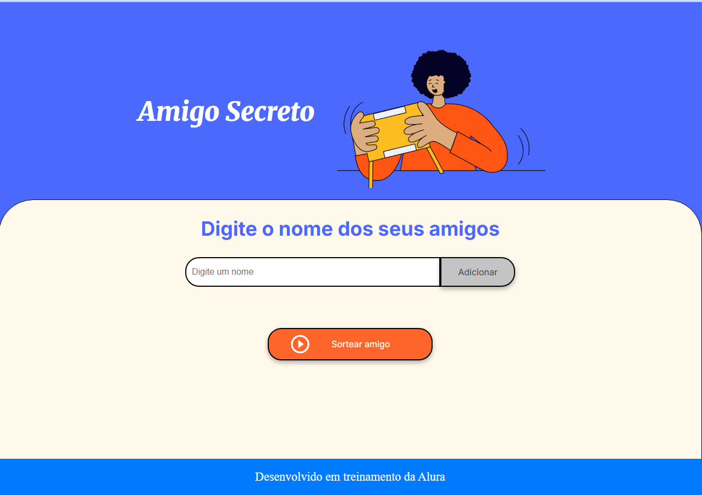
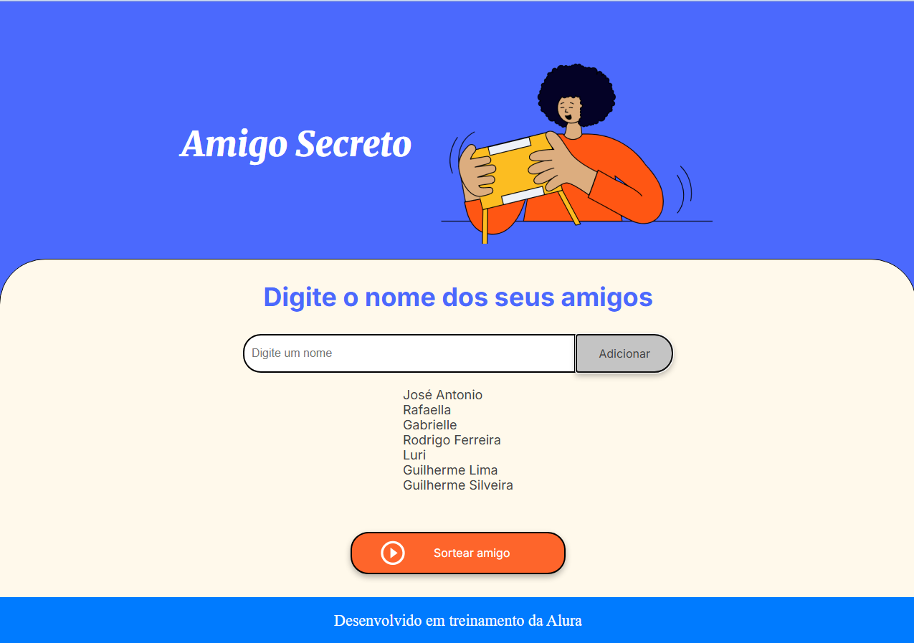

# Sorteio de Amigo Secreto

> Uma aplicação web simples que facilita a organização e realização do sorteio de Amigo Secreto, garantindo que os nomes não se repitam.

## Visão Geral

Este projeto foi desenvolvido com o objetivo de simplificar o processo de sorteio de Amigo Secreto. 
Usando uma interface intuitiva, permite adicionar os participantes e realizar o sorteio de forma rápida e segura, 
evitando a necessidade de métodos manuais que podem ser propensos a erros ou repetições.

## Funcionalidades Principais

* **Adição de Participantes:** Permite inserir o nome de cada participante através de um campo de texto.
* **Listagem de Participantes:** Exibe em tempo real a lista dos nomes conforme vão sendo adicionados.
* **Sorteio Aleatório:** Realiza o sorteio dos amigos secretos de forma automática e aleatória.
* **Visualização dos Resultados:** Apresenta de forma clara quem tirou quem no sorteio.

## Como Usar

Siga estas etapas para utilizar o Sorteio de Amigo Secreto:

1.  Clone este repositório para o seu computador:
  
2.  Abra o arquivo `index.html` no seu navegador web preferido.

### Interface

A aplicação possui uma interface simples e direta:

*Tela inicial do aplicativo com campo para digitação dos participantes e botão para adicionar.*

*Lista dos participantes adicionados e botão para iniciar o sorteio.*

*Lista dos participantes sorteados com seu respectivo Amigo Secreto.*

3.  No campo de texto "Digite o nome dos seus amigos", insira o nome de um participante e clique no botão "Adicionar". O nome será adicionado à lista logo abaixo.
4.  Repita o passo anterior para todos os participantes que farão parte do Amigo Secreto.
5.  Após adicionar todos os participantes (é necessário um mínimo de dois), clique no botão "Sortear amigo".
6.  Os resultados do sorteio serão exibidos na tela, mostrando o par de cada participante.

## Tecnologias Utilizadas

Este projeto foi desenvolvido durante treinamento da Alura utilizando as seguintes tecnologias web fundamentais:

* HTML: Para a estrutura da página web.
* CSS: Para a estilização e apresentação visual.
* JavaScript: Para a interatividade e a lógica do sorteio.

## Créditos

Desenvolvido em treinamento da Alura por José Antonio Morandi
